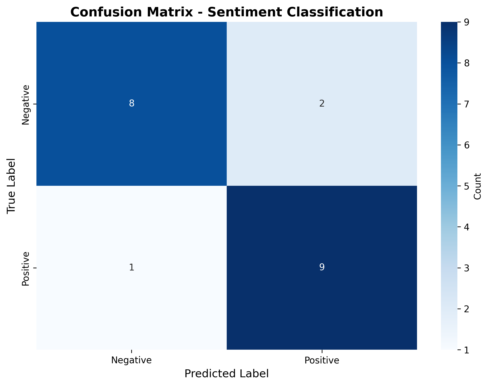
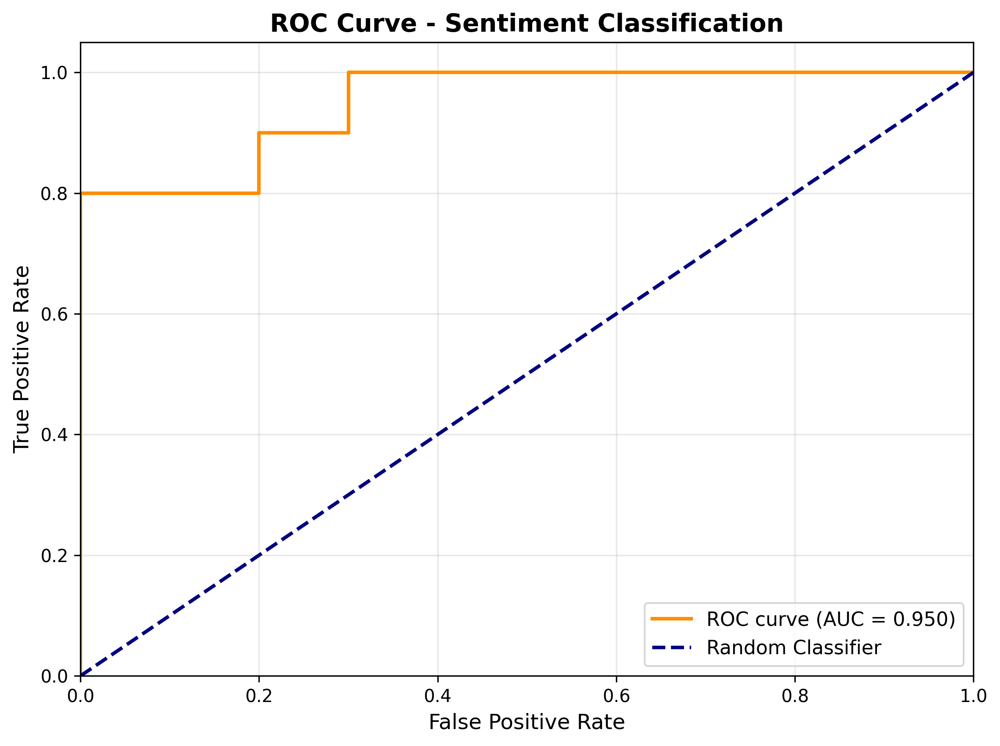
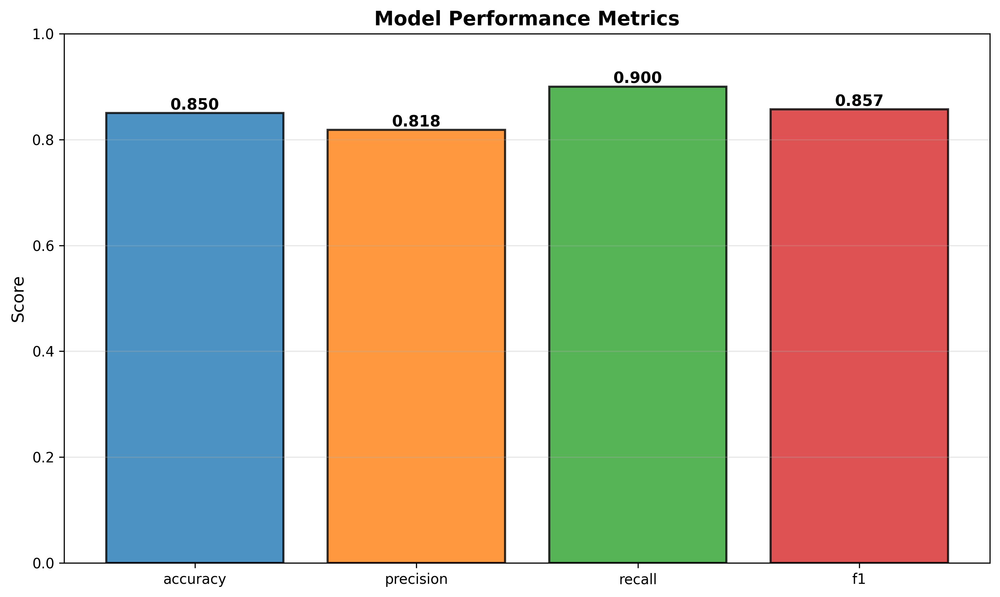
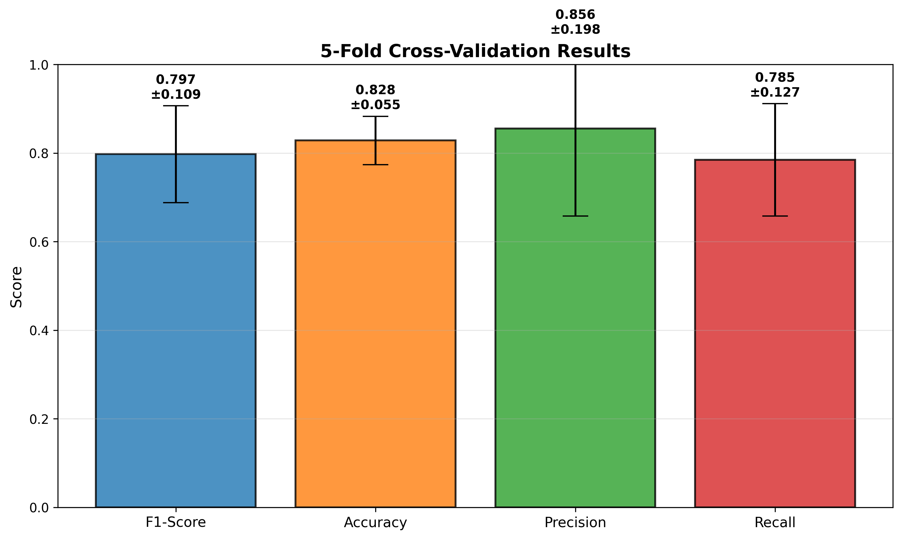
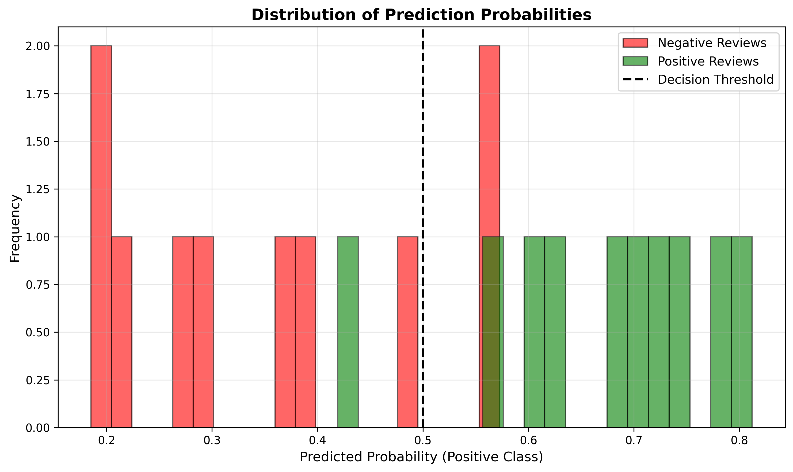
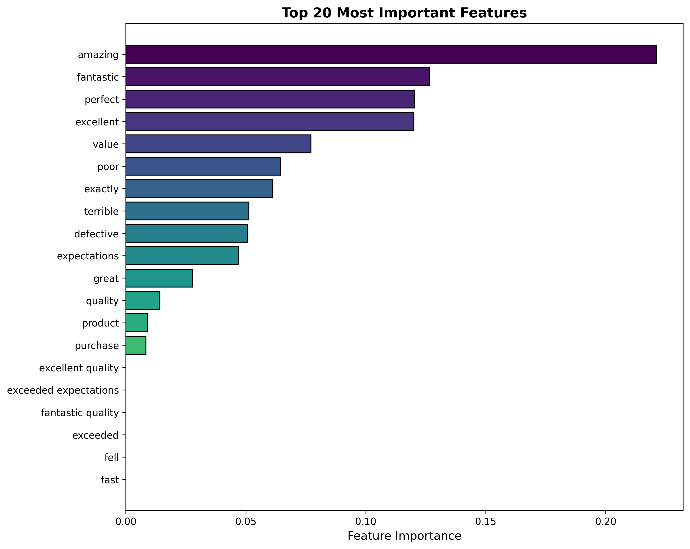

# NLP Sentiment Analysis — Product Reviews

End-to-end machine learning project that classifies product reviews as **positive** or **negative**.

| Accuracy | F1-Score | AUC-ROC |
|:---:|:---:|:---:|
| **85%** | **85.7%** | **95%** |

*(Hold-out test set of 20 reviews — see [Results](#results).)*

---

## Table of Contents

- [Overview](#overview)
- [Quick Start](#quick-start)
- [Project Structure](#project-structure)
- [Pipeline Details](#pipeline-details)
- [Results](#results)
- [Testing](#testing)
- [Windows Encoding Notes](#windows-encoding-notes)
- [Requirements](#requirements)

---

## Overview

| Component | Technique |
|---|---|
| Text cleaning | Lowercase, strip URLs / special characters / numbers |
| Tokenization | NLTK `punkt` |
| Stopword removal | NLTK `stopwords` |
| Feature engineering | TF-IDF (unigrams + bigrams) |
| Models | Logistic Regression + XGBoost |
| Combination | Soft-voting ensemble |
| Validation | 5-fold cross-validation |
| Inference | `SentimentPredictor` class |

---

## Quick Start

### 1. Clone and install

```bash
git clone <your-repo-url>
cd NLP-Sentiment-Analysis-S
python -m venv venv
```

Activate the virtual environment:

```powershell
# Windows (PowerShell)
.\venv\Scripts\Activate.ps1
```

```bash
# Linux / macOS
source venv/bin/activate
```

Install dependencies:

```bash
pip install -r requirements.txt
```

### 2. Run the full pipeline

```bash
python main.py
```

This will:

1. Load and analyze the dataset
2. Preprocess text (cleaning → tokenization → TF-IDF)
3. Train the ensemble model
4. Evaluate on the test set (metrics + confusion matrix)
5. Make predictions on sample reviews
6. Save visualizations and an analysis report

### 3. Output

| Artifact | Path |
|---|---|
| Trained model | `models/sentiment_model.pkl` |
| Fitted TF-IDF vectorizer | `data/preprocessor.pkl` |
| Feature matrices | `data/X_train.pkl`, `data/X_test.pkl` |
| Labels | `data/y_train.pkl`, `data/y_test.pkl` |
| Plots | `results/*.png` |
| Text report | `results/analysis_report.txt` |

---

## Project Structure

```text
NLP-Sentiment-Analysis-S/
├── data/
│   ├── reviews.csv            # Dataset (96 reviews, balanced 48/48)
│   ├── X_train.pkl, X_test.pkl
│   ├── y_train.pkl, y_test.pkl
│   └── preprocessor.pkl       # Fitted TF-IDF vectorizer
│
├── src/
│   ├── preprocess.py          # Text cleaning + TF-IDF
│   ├── train.py               # Model training + CV + evaluation
│   ├── predict.py             # Inference
│   ├── analysis.py            # Visualizations + report
│   └── tests.py               # Unit + integration tests
│
├── models/
│   └── sentiment_model.pkl    # Trained ensemble
│
├── results/                   # Generated outputs
│
├── main.py                    # End-to-end pipeline
├── requirements.txt
├── .gitignore
└── README.md
```

---

## Pipeline Details

### 1. Data preprocessing (`src/preprocess.py`)

| Step | Operation |
|:---:|---|
| 1 | Lowercase text |
| 2 | Remove URLs, special characters, numbers |
| 3 | Tokenize (NLTK `punkt`) |
| 4 | Remove stopwords (NLTK `stopwords`) |
| 5 | TF-IDF vectorization |
| 6 | Stratified 80/20 train-test split |

**TF-IDF parameters**

| Parameter | Value | Meaning |
|---|---|---|
| `max_features` | 100 | Keep the top 100 terms |
| `ngram_range` | (1, 2) | Unigrams + bigrams |
| `min_df` | 2 | Term must appear in ≥ 2 documents |
| `max_df` | 0.8 | Term must not appear in > 80% of documents |

### 2. Model training (`src/train.py`)

| Model | Role | Why |
|---|---|---|
| Logistic Regression | Linear baseline | Fast, interpretable |
| XGBoost | Non-linear classifier | Captures more complex patterns |
| Soft-voting ensemble | Combines both | Averages predicted probabilities |

**Validation and persistence**

| Item | Detail |
|---|---|
| Cross-validation | 5-fold |
| Metrics | Accuracy, Precision, Recall, F1, AUC-ROC |
| Serialization | `pickle` for model and preprocessor |

### 3. Inference (`src/predict.py`)

```python
from src.predict import SentimentPredictor

predictor = SentimentPredictor(
    model_path="models/sentiment_model.pkl",
    preprocessor_path="data/preprocessor.pkl",
)

# Single review
result = predictor.predict_single("This product is amazing!")
print(result)
# {'sentiment': 'Positive ✓', 'confidence': 0.74, 'probabilities': {...}}

# Batch
results = predictor.predict_batch(["Great!", "Terrible!"])
```

---

## Results

### Cross-validation (5-fold)

| Metric | Mean | Std |
|---|:---:|:---:|
| F1-Score | 0.7973 | ± 0.1091 |
| Accuracy | 0.8283 | ± 0.0547 |
| Precision | 0.8556 | ± 0.1975 |
| Recall | 0.7845 | ± 0.1268 |

### Test set

| Metric | Value |
|---|:---:|
| Accuracy | 0.8500 |
| Precision | 0.8182 |
| Recall | 0.9000 |
| F1-Score | 0.8571 |
| AUC-ROC | 0.9500 |

### Confusion matrix

| | Predicted Negative | Predicted Positive |
|---|:---:|:---:|
| **Actual Negative** | 8 (TN) | 2 (FP) |
| **Actual Positive** | 1 (FN) | 9 (TP) |

| Summary | Value |
|---|:---:|
| Correct | 17 / 20 |
| Incorrect | 3 / 20 |
| Error rate | 15.00% |
| False positives | 2 |
| False negatives | 1 |

> **Note:** The dataset is small (96 reviews), so the test set has only 20 samples — a single
> misclassified review changes accuracy by 5 points. Cross-validation scores vary noticeably between
> folds (see the standard deviations above). Treat these numbers as indicative rather than a benchmark.

### Figures

Generated by the pipeline in `results/`:

| Confusion matrix | ROC curve |
|:---:|:---:|
|  |  |

| Test metrics | Cross-validation |
|:---:|:---:|
|  |  |

| Probability distribution | Feature importance |
|:---:|:---:|
|  |  |

---

## Testing

```bash
python src/tests.py
```

Runs 17 unit and integration tests:

| Area | Tests |
|---|:---:|
| Data loading | 1 |
| Preprocessing (clean text, empty/`None` input, numbers, special chars) | 6 |
| Vectorizer (fit, transform, not-fitted error) | 3 |
| Model (init, build ensemble, train, predict, `predict_proba`, save/load) | 6 |
| Integration (preprocess → train) | 1 |

Expected result: `OK`.

---

## Windows Encoding Notes

If you see:

```text
UnicodeEncodeError: 'charmap' codec can't encode character '\u2713'
```

the Windows console is using a legacy code page (e.g. cp1251) instead of UTF-8.

**Option A — quick fix (per session):**

```powershell
chcp 65001
$env:PYTHONUTF8="1"
python main.py
```

**Option B — built in:** `main.py` already wraps `sys.stdout` / `sys.stderr` in a UTF-8 `TextIOWrapper` on Windows, so `✓`, `✗` and `→` render correctly as long as the console code page is UTF-8.

> ⚠️ **Avoid PowerShell's `Tee-Object`.** It decodes output using the legacy code page and garbles Unicode.
> To save a log, redirect instead:
>
> ```powershell
> python main.py > results/run_log.txt
> ```

---

## Requirements

| Requirement | Version |
|---|---|
| Python | 3.10+ |
| scikit-learn | see `requirements.txt` |
| xgboost | see `requirements.txt` |
| pandas, numpy | see `requirements.txt` |
| matplotlib, seaborn | see `requirements.txt` |
| nltk | see `requirements.txt` |

Install everything:

```bash
pip install -r requirements.txt
```

---

## License

MIT
